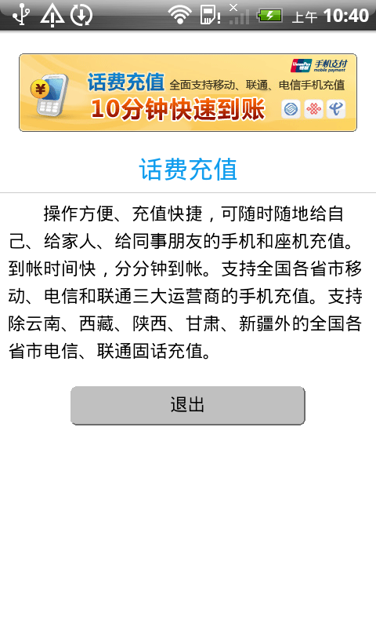
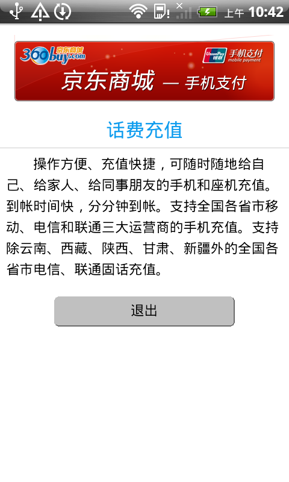

#该文件夹用于测试下载和AMS能力

##文件结构说明
	├── LocalMode 本地运行模式测试文件夹
	|   ├── AppsOnServer 部署在服务器上的应用
	|   ├── portal portal应用
	|   ├── preinstalledApp 预装应用
	|   └── config.xml 开发人员使用
	├── OnlineMode 离线应用运行模式的测试文件夹
	|   ├── AppsOnServer 部署在服务器上的应用
	|   ├── portal portal应用
	|   ├── preinstalledApp 预装应用
	|   └── config.xml 开发人员使用
    ├── img 示例图片文件夹
	├── readme.html
	└── readme.md

##测试前注意事项
**测试人员不需要关注**
>+ 需要将*LocalMode/AppsOnServer/*下的所有zip文件拷贝到**ftp://192.168.2.245/paas/apps/localApp/**中
>+ 需要将*OnlineMode/AppsOnServer/*下的所有zip文件拷贝到**ftp://192.168.2.245/paas/apps/**中，再将其他非zip文件夹拷贝到 **ftp://192.168.2.245/paas/apps/offlineApp/**目录下

##开发人员测试步骤

###测试离线应用运行模式
>####测试前的准备工作
>#####测试非player
>1. 将OnlineMode文件夹下**portal** 、 **preinstalledApp**、 **config.xml**拷贝到工程的**assets/data/**目录下
>#####测试player
>1. 将**OnlinePortal/portal/**文件夹下的所有文件拷贝到**sdcard/xFacePlayer/Application/app/**下

>####测试步骤
>1. 运行工程
>2. 进入应用，下载所有应用，如果所有应用都可以正确下载并运行（确保下载的应用都运行一遍），则下载测试通过 
>3. 然后在断网的情况下，看已安装的应用是否可以全部运行，如果可以，则测试通过

###测试本地运行模式：
>####测试前的准备工作
>#####测试非player
>1. 将LocalMode文件夹下**portal** 、 **preinstalledApp**、 **config.xml**拷贝到工程的**assets/data/**目录下
>#####测试player
>1. 将**LocalMode/portal/**文件夹下的所有文件拷贝到**sdcard/xFacePlayer/Application/app/**下
>####测试步骤
>1. 运行工程
>2. 进入应用，下载所有应用，如果所有应用都可以正确下载并运行，则下载测试通过

##测试人员测试步骤
###测试离线应用运行模式
>#####测试非player步骤
>1. 将最新版的**xface.js**文件拷贝到*OnlineMode/preinstalledApp/*文件夹下 ( **如果没有可以找开发人员提供**)
>2. 将*OnlineMode/portal/*文件夹下的所有文件压缩成**portal.zip**文件
>3. 将*OnlineMode/preinstalledApp/*文件夹下的所有文件压缩成**preinstalledApp.zip**文件
>4. 访问[XCPS](http://www.polyvi.net:8011/android)
>5. 在**需要打包的web程序(startapp)**项上传**portal.zip**文件
>6. 在**预装web应用**项上传**preinstalledApp.zip**文件
>7. 打包，下载并安装apk
>8. 运行应用，在首页看是否有**航班**应用，如果没有则测试不通过，如果有，进行下面的步骤
>9. 点击页面上面的选项栏第三格**应用集市**，进入下载应用界面，下载所有应用，如果所有应用都可以正确下载，并且正确运行（**确保下载的每个应用都运行一遍，如果出现“本地能力未正确加载”属于正常情况**），则下载安装功能测试通过
>10. 退出xFace引擎，然后关闭WIFI，启动引擎看已安装的应用是否可以全部运行，如果可以，则离线应用功能测试通过。（**注意：应用中图片显示不出来是正常情况，打鸭子应用不需要测试**）
>#####测试更新app是否清除webview缓存
>1.假设此时我们的应用已经安装，点击**应用集市**，进入下载应用界面
>2.点击**话费直充**，点击**安装**，安装成功后，点击**确定**进入应用，界面为
>

 
>
图1
 
>3.退出应用，再次进入**话费直充**，点击**更新**，更新成功后，点击**确定**进入应用，界面为
>

 
>
图2
 
>则测试通过。如果界面还是如 **图1** 所示，则测试不通过
>#####测试player步骤
>1. 访问[XCPS](http://www.polyvi.net:8011/android)
>2. 打包player，下载并安装apk
>3. 将*OnlinePortal/portal/*文件夹下的所有文件拷贝到*sdcard/xFacePlayer/applications/app/*目录下
>4. 运行应用
>5. 点击页面上面的选项栏第三格**应用集市**，进入下载应用界面，下载所有应用，如果所有应用都可以正确下载，并且正确运行（**确保下载的每个应用都运行一遍，如果出现“本地能力未正确加载”属于正常情况**），则下载安装功能测试通过
>6. 退出xFace引擎，然后关闭WIFI，启动引擎看已安装的应用是否可以全部运行，如果可以，则离线应用功能测试通过。(**注意：应用中图片显示不出来是正常情况，打鸭子应用不需要测试**)
>#####测试更新app是否清除webview缓存
>同非player的步骤相同

###测试本地运行模式：
>#####测试非player步骤
>1. 将最新版的**xface.js**文件拷贝到 *LocalMode/preinstalledApp/*文件夹下( **如果没有可以找开发人员提供**)
>2. 将*LocalMode/portal/*文件夹下的所有文件压缩成**portal.zip**文件
>3. 将*LocalMode/preinstalledApp/*文件夹下的所有文件压缩成**preinstalledApp.zip**文件
>4. 访问[XCPS](http://www.polyvi.net:8011/android)
>5. 在**需要打包的web程序(startapp)**项上传**portal.zip**文件
>6. 在**预装web应用**项上传**preinstalledApp.zip**文件
>7. 打包，下载并安装apk
>8. 运行应用，在首页看是否有**航班**应用，如果没有则测试不通过，如果有，进行下面的步骤
>9. 点击页面上面的选项栏第三格**应用集市**，进入下载应用界面，下载所有应用，如果所有应用都可以正确下载并运行，则测试通过
>#####测试更新app是否清除webview缓存
>1.假设此时我们的应用已经安装，点击**应用集市**，进入下载应用界面
>2.点击**话费直充**，点击**安装**，安装成功后，点击**确定**进入应用，界面为
>

 
>
图1
 
>3.退出应用，再次进入**话费直充**，点击**更新**，更新成功后，点击**确定**进入应用，界面为
>

 
>
图2
 
>则测试通过。如果界面还是如 **图1** 所示，则测试不通过
>#####测试player步骤
>1. 访问[XCPS](http://www.polyvi.net:8011/android)
>2. 打包player，下载并安装apk
>3. 将*LocalMode/portal/*文件夹下的所有文件拷贝到*sdcard/xFacePlayer/applications/app/*目录下
>4. 运行应用
>5. 点击页面上面的选项栏第三格**应用集市**，进入下载应用界面，下载所有应用，如果所有应用都可以正确下载并运行，则下载安装功能测试通过
>#####测试更新app是否清除webview缓存
>同非player的步骤相同